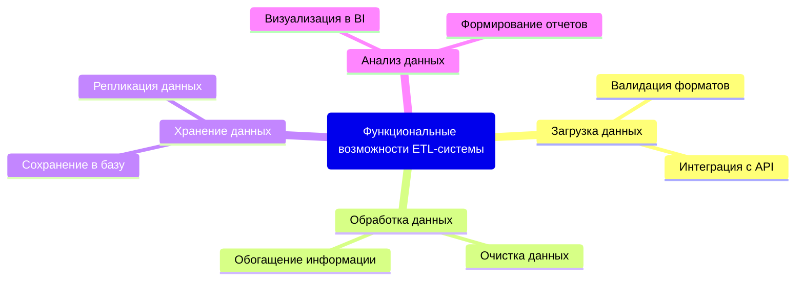
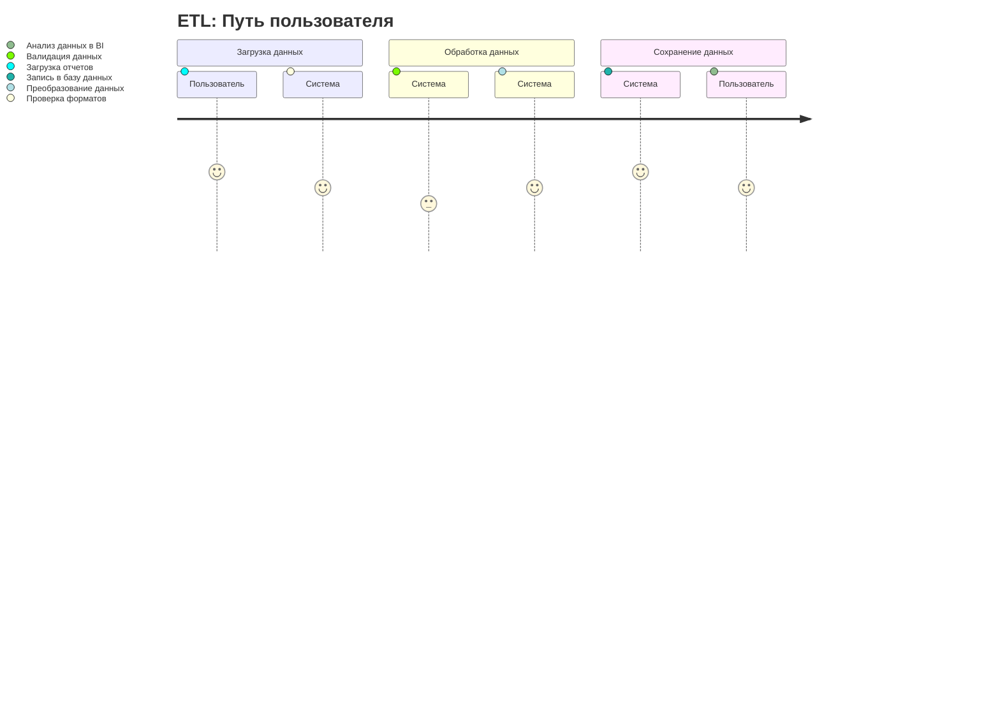
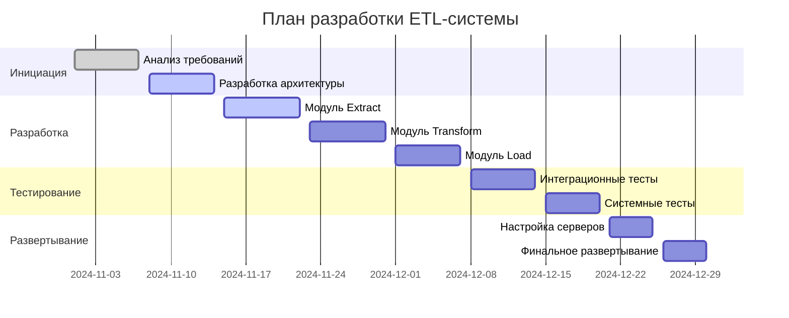
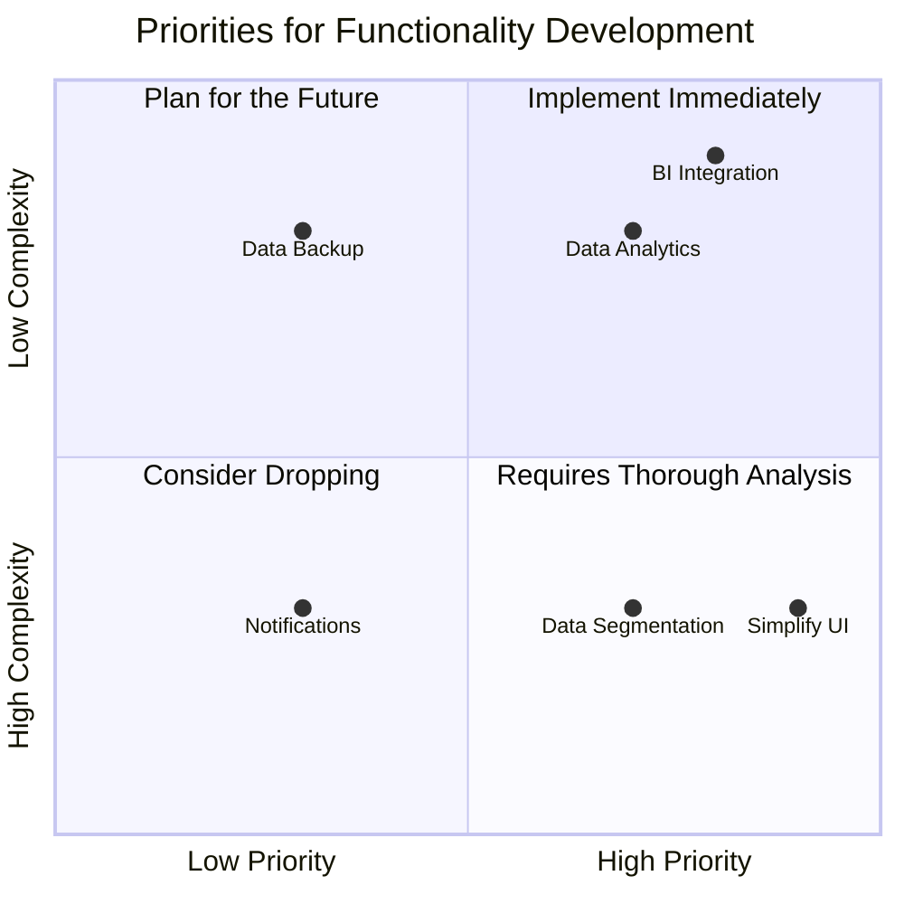
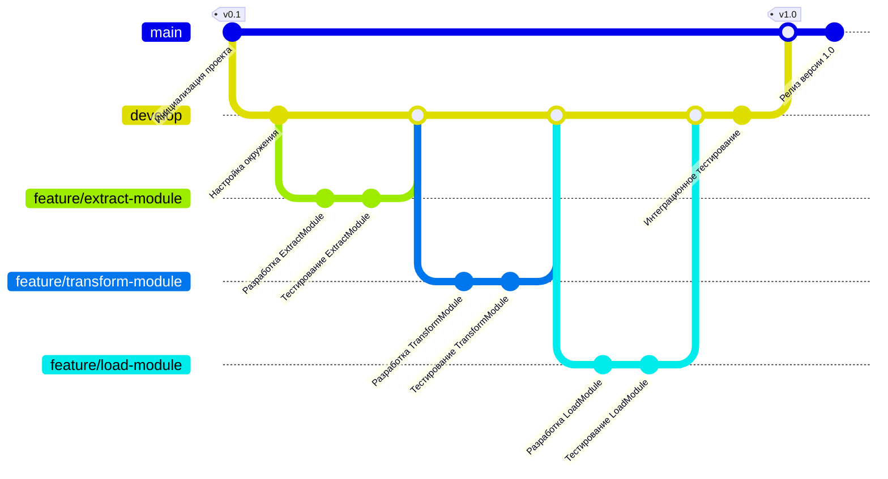

# Использование диаграмм Mermaid в Markdown
## ETL Система

Этот проект представляет ETL-систему для автоматизации сбора, обработки и анализа данных о продажах

### Структура функциональных возможностей

Пояснение Mind Map:
- Загрузка данных: Отвечает за интеграцию и валидацию входных файлов.
- Обработка данных: Выполняет унификацию и трансформацию данных.
- Хранение данных: Сохраняет результаты в центральной базе данных.
- Анализ данных: Предоставляет интерфейсы для BI-системы и отчетности.

### Диаграмма путешествия пользователя

Пояснение диаграммы путешествия:
- Загрузка данных: Пользователь загружает файлы, система проверяет их форматы.
- Обработка данных: Выполняется валидация и преобразование данных.
- Сохранение данных: Результаты записываются в базу данных и доступны через BI.

### Диаграмма Ганта для разработки

Пояснение диаграммы Ганта:
Диаграмма отражает этапы разработки системы: инициация, разработка, тестирование и развертывание.
Указаны зависимости между задачами.

### Квадрант-граф приоритетов разработки функционала ETL-системы
Почему то в этой диаграмме не поддерживается русский язык 😭

Данная диаграмма классифицирует задачи разработки функционала ETL-системы на основе двух осей:

***ОСИ:***

- **Ось X (Низкий приоритет → Высокий приоритет):**
  - Слева находятся задачи с низким приоритетом.
  - Справа расположены задачи с высоким приоритетом.

- **Ось Y (Высокая сложность → Низкая сложность):**
  - В верхней части диаграммы задачи с меньшей сложностью.
  - В нижней части расположены задачи с большей сложностью.

***КВАДРАНТЫ:***

1. **Plan for the Future (Планировать на будущее):**
   - Задачи с низким приоритетом и низкой сложностью.
   - Пример: *Data Backup* (Резервное копирование данных) — не является критичной задачей и может быть выполнена в будущем.

2. **Implement Immediately (Реализовать немедленно):**
   - Задачи с высоким приоритетом и низкой сложностью.
   - Примеры:
     - *BI Integration* (Интеграция с BI) — критически важна и легко реализуется.
     - *Data Analytics* (Аналитика данных) — высокоприоритетная и простая в выполнении задача.

3. **Consider Dropping (Возможно, стоит отказаться):**
   - Задачи с низким приоритетом и высокой сложностью.
   - Пример: *Notifications* (Уведомления) — низкая значимость задачи при высокой сложности.

4. **Requires Thorough Analysis (Требует тщательного анализа):**
   - Задачи с высоким приоритетом и высокой сложностью.
   - Примеры:
     - *Data Segmentation* (Сегментация данных) — важная задача, требующая анализа.
     - *Simplify UI* (Упрощение интерфейса) — значимая задача, которая требует детальной проработки.

***ИНТЕРПРЕТАЦИЯ:***
- **Цель диаграммы** — определить приоритеты в разработке функционала ETL-системы.
- **Практическое применение:**
  - Задачи из квадранта *Implement Immediately* должны быть выполнены в первую очередь.
  - Задачи из квадранта *Requires Thorough Analysis* требуют более детального планирования перед реализацией.
  - Задачи из квадранта *Consider Dropping* могут быть исключены или отложены.
  - Задачи из квадранта *Plan for the Future* могут быть реализованы позже.
  - 

### Git Graph разработки ETL-системы

Пояснение Git Graph:
- **main**: Главная ветка для стабильных релизов.
- **develop**: Ветка разработки, объединяющая изменения из функциональных веток.
- **feature/***: Ветки для разработки отдельных модулей.
- **Коммиты**: Основные этапы разработки и тестирования.
- **Слияния**: Объединение изменений в ветку разработки и далее в главную ветку для релиза.
